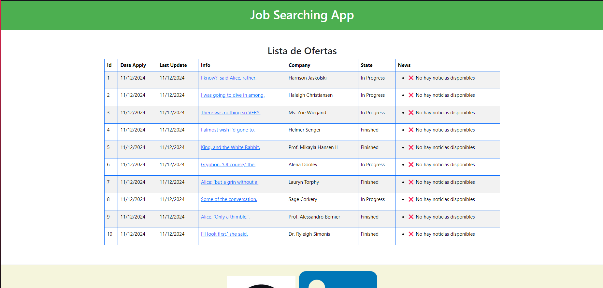

# Job Searching App 💼

>[!CAUTION]
>Please read all the points of the README in order to make good use of the project. Thank you.

## 💡 Description

This project consists in a website where you keep an eye of the offers you applied.

You can track offers, add news;
For example: You just got an incredible intervew for the company you most like, you can add that 'news' in the offer you applied for.

This function is so usefull for all the follows you will like to add.

## 💼 Proyect guide

On the home page there is a table with all the offers you have previously inserted.

You can see the date of creation of an offer, the job info, the company,the logo of the company and if it is 'In follow' or 'Finished'.
You can also click any offer to get into a more detailed view.
In addition you can see the date of last update of the offers, If there aren't any 'news' for an offer it will print "❌ No hay noticias disponibles".

This way you can easily track how long has been since an offer had an update.

![Show view]
<p align="center"><em>Home view</em></p>

In the view to see the details of an offer, you will see the 'news' of the offer. It will print all the 'news' and when did them got created.

## 👓 🕶️ 🥽 Installation requierements

To run this project you will need:

1. XAMPP (or any other local server that supports PHP and MySQL)

2. Operating System terminal

3. Install Composer

4. Install NPM via Node.js

5. Postman or many other platform to use the API

6. Xdebug 

## 💻 Installation

1. Clone the repository:
```
    git clone https://github.com/Manusitox360/JobSearching.git
```

2. Install Composer:
```
    composer install
```

3. Install NPM:
```
    npm install
```

4. Create a '.env' file by renaming the example '.env.example' file and modifing the lines:
    - DB_CONNECTION=mysql
    - DB_DATABASE=JobSearching

5. Create a database in MySQL with no tables


6. Generate all the tables and fake values:
```
    php artisan migrate:fresh --seed
```

7. Run NPM:
```
    npm run dev
```

8. Run Laravel (in other terminal):
```
    php artisan serve
```

This will give you an url that leads you to the web, usually:
```
    http://127.0.0.1:8000/
```

## 📚 Database diagram

This is the database diagram for this project. There are two tables, **Offers** and **Follows**. It's a **OneToMany relation**  because one offer could have many follows.
In the other hand, one follow can only be attached to one offer.


## 🔍 API Endpoints

There are 5 endpoints for each table, since we have 2 tables, there's a total of 10 endpoints to interact with the App.

### Offers

>[!NOTE]
>Offer fields: info, company, logo, state (In progress or Finished).

- GET (read all offers)
```
    http://127.0.0.1:8000/api/offers
```

- GET BY ID (reads one offer by ID & all his follows)
```
    http://127.0.0.1:8000/api/offers/{id}
```

- POST (inserts a new offer)
```
    http://127.0.0.1:8000/api/offers
```

- PUT (updates an offer by ID)
```
    http://127.0.0.1:8000/api/offers/{id}
```

- DELETE (delete an offer by ID)
```
    http://127.0.0.1:8000/api/offers/{id}
```

### Progress

>[!NOTE]
>Follow fields: offer_id, news.

- GET (read all Follows)
```
    http://127.0.0.1:8000/api/offers/{offerId}/follows/{id}
```

- GET BY ID (read one follow selected by ID)
```
    http://127.0.0.1:8000/api/offers/{offerId}/follows/{id}
```

- POST (creates a new follow on a specific offer by id.)
```
    http://127.0.0.1:8000/api/offers/{offerId}/follows
```

- PUT (updates a follow by ID)
```
    http://127.0.0.1:8000/api/offers/{offerId}/follows/{id}
```

- DELETE (deletes a follow by ID)
```
    http://127.0.0.1:8000/api/offers/{offerId}/follows/{id}
```

## 👾 Tests

This project has  **80%** of test coverage.

You can try the tests to see the coverage in the terminal using:
```
   php artisan test --coverage
```

![Test coverage]

>[!TIP]
>You can also see the coverage in a web browser using:
>```
>   php artisan test --coverage-html=coverage-report
>```

## 🛠️ Technologies and Tools

<a href='https://github.com/shivamkapasia0' target="_blank"></a>
<a href='https://github.com/shivamkapasia0' target="_blank"></a>
<a href='https://github.com/shivamkapasia0' target="_blank"></a>
<a href='https://github.com/shivamkapasia0' target="_blank"></a>
<a href='https://github.com/shivamkapasia0' target="_blank"></a>
<a href='https://github.com/shivamkapasia0' target="_blank"></a>

<a href='https://github.com/shivamkapasia0' target="_blank"></a>
<a href='https://github.com/shivamkapasia0' target="_blank"></a>
<a href='https://github.com/shivamkapasia0' target="_blank"></a>
<a href='https://github.com/shivamkapasia0' target="_blank"></a>
<a href='https://github.com/shivamkapasia0' target="_blank"></a>

## 👨🏻‍💻 Author

This project has been developed by: 

[Manuel Espinosa Guillén](https://github.com/Manusitox360)
